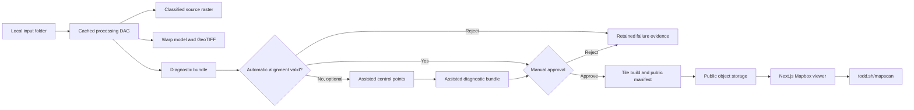

# MapScan Product and Technology Requirements

Status: Draft v0.6
Date: 2026-08-31
Owner: Todd Sherman

## 1. Executive Summary

MapScan is a proof of concept that automatically converts images of thematic California maps into geographically aligned, interactive overlays on a Mapbox basemap. Most inputs are categorical rasters; named line and polygon maps form a separate feature-geometry branch.

The interesting product is the processing pipeline: it must find and interpret the legend, extract source-pixel categories with high precision, infer geographic alignment from California's border and coastline, warp the classified data without inventing values, measure its own confidence, and reject unreliable results. The public viewer exists to demonstrate a curated set of successful pipeline outputs.

MapScan is not a public upload service. Todd adds images to a local folder, runs a resumable offline pipeline, reviews diagnostic evidence, approves good results, and publishes a static catalog. Public visitors can explore the approved datasets at the exact path `todd.sh/mapscan`.

Alignment has two explicitly separate paths. Automatic alignment receives only the image and may reject it. Assisted alignment is an author-only fallback in which Todd supplies paired geographic control points. Every manifest and evaluation report must distinguish these paths so manual help can never inflate automatic performance claims.

## 2. Decision Status Vocabulary

- **Confirmed:** Agreed product requirement.
- **Proposed:** Recommended implementation, subject to normal engineering validation.
- **Spike:** A bounded experiment required before choosing an implementation.
- **Deferred:** Explicitly outside the initial proof of concept.
- **Superseded:** Retained as decision history but no longer controls current implementation or acceptance.

## 3. Goals

### 3.1 Primary goals

1. Automatically process varied web images containing categorical California map data.
2. Recover legend labels, solid-color swatches, symbol keys, on-map feature labels, and group hierarchy when present.
3. Assign high-confidence source pixels to stable category identifiers and mark ambiguous pixels transparent.
4. Align full-state and partial-state maps directly against pinned Mapbox-derived California coastline, state-border, and county geometry; source-map boundary evidence determines which reference segments are visible.
5. Preserve source fidelity through an original-resolution classified raster and categorical-safe geospatial transform.
6. Produce inspectable evidence for every success, omission, warning, and rejection.
7. Publish a curated set of approximately 20–100 accepted datasets in an interactive desktop viewer.
8. Preserve reproducible records of the AI models, deterministic algorithms, parameters, costs, and outputs used by the processing pipeline.

### 3.2 Proof-of-concept success

- A corpus of 100 varied candidate images is divided into development, validation, and untouched test sets.
- Approximately 60–80 of the 100 images are accepted with good output; clear rejection of the remainder is acceptable.
- Ten to twenty images have trusted reference annotations for quantitative evaluation.
- Automatic ingestion requires only an image. No per-image crop fixes, color-threshold tuning, or geographic control points are supplied by the author.
- Rejected automatic attempts may be rerun in assisted alignment mode, but automatic and assisted acceptance rates are reported separately.
- Failures improve the general pipeline and trigger corpus reprocessing rather than hand-patching extracted pixels.
- The published case study can explain which steps used AI and which used deterministic image processing or geospatial math.

## 4. Non-Goals

The first proof of concept will not provide:

- Public image uploads, user accounts, or project persistence
- A general worldwide map-ingestion service
- Photographs of paper maps, folds, shadows, or camera-perspective correction
- General continuous quantitative surfaces and arbitrary unlabeled point-symbol maps
- Arbitrary overlap recovery when the source rendering is opaque or spectrally underdetermined; limited ordinal gradients, hatch masks, and two-way transparent color mixtures are experimental
- Multi-panel maps or inset-map extraction
- Unmarked recovery of data hidden beneath labels, borders, legends, or other source graphics; conservative reconstruction is allowed only as a separate inferred artifact
- Replacement of source evidence with external vector data; derived feature vectors must retain an observed-raster audit trail
- GIS downloads, a public API, or embedding tools
- Mobile-first authoring or a complete mobile layer manager
- Point queries or click-to-inspect values
- Public source-versus-result comparison tools
- Source attribution or provenance as a product feature

## 5. Users and Workflows

### 5.1 Author workflow

1. Add a standard PNG, JPEG, WebP, or TIFF image to an input folder.
2. Run a single batch command against new or changed inputs.
3. Allow the pipeline to run asynchronously for an hour or more if necessary.
4. Open a generated diagnostic report.
5. Review legend parsing, category masks, omissions, alignment overlays, residual errors, and warnings.
6. If automatic alignment is rejected, optionally open the assisted alignment UI, add widely distributed paired control points, and review the resulting warped inspection view.
7. Correct semantic metadata or presentation configuration when needed.
8. Approve or reject the result.
9. Run the publish command to update public assets and the catalog manifest.
10. Deploy the viewer independently from the main `todd.sh` project.

### 5.2 Public visitor workflow

1. Open `todd.sh/mapscan` on desktop.
2. Browse a simple list of available datasets.
3. Build one persistent composition from categories belonging to multiple datasets.
4. Focus any dataset to inspect and edit its controls without clearing selections from other datasets.
5. Expand each dataset's legend hierarchy.
6. Toggle individual categories or groups.
7. Change each category's color and transparency.
8. Clear one dataset or the complete map composition explicitly.
9. Pan and zoom on a light Mapbox basemap.
10. Open the retained source image in a modal or separate window.
11. Copy a URL that restores the current map and layer state.

## 6. Domain Model

- **Dataset:** One processed source image.
- **Group:** A hierarchical legend heading such as “Field Crops.”
- **Category:** An individual legend entry such as “Cotton.”
- **Class ID:** A stable positive integer assigned to a category. Zero is reserved for NoData/transparent.
- **Source classified raster:** A raster with the source image's original pixel dimensions in which every pixel is a class ID or NoData.
- **Georeferenced classified raster:** A warped categorical raster in a known coordinate reference system.
- **Observed feature raster:** A lossless mask of line, polygon, or point ink actually present in the source after non-data graphics are excluded.
- **Inferred-pixel mask:** A separate mask identifying every pixel or geometry segment reconstructed rather than directly observed.
- **Named feature:** An interpreted line or polygon with a source-derived geometry, semantic type, and OCR- or gazetteer-validated name.
- **Data layer:** The renderable data for one category.
- **Variable:** One independently controllable quantity in a source image. A dataset may contain several variables even when each variable is internally categorical or binary.
- **Run:** One versioned execution of the processing DAG for an input image.
- **Alignment mode:** Either `automatic` (image-only) or `assisted` (author-supplied paired control points).
- **Diagnostic bundle:** Human-inspectable and machine-readable evidence generated by a run.
- **Published manifest:** Static configuration describing all approved public datasets.

## 7. Product Requirements

### 7.1 Input and scope

- **PR-IN-001 — Confirmed:** The automatic pipeline accepts one source path (a standard image or a PDF that can be rendered as an image); all initial sources concern California.
- **PR-IN-002 — Confirmed:** Images may show all, most, or a recognizable part of California.
- **PR-IN-003 — Confirmed:** A partial map must contain enough state coastline, state border, or fallback county geometry for automatic alignment.
- **PR-IN-004 — Confirmed:** Input publishers, resolutions, layouts, legend positions, compression levels, and visual styles may vary.
- **PR-IN-005 — Superseded:** A source may contain several independent variables. Each variable is represented as its own categorical or binary layer; categories within one categorical variable remain mutually exclusive.
- **PR-IN-006 — Proposed:** Intake validates decodability, dimensions, color space, file hash, and basic image statistics before expensive work begins.
- **PR-IN-007 — Confirmed:** Ordinal legend classes rendered with gradients or hillshade may be attempted by learning the within-class color range. This does not authorize inventing a continuous physical measurement absent from the legend.
- **PR-IN-008 — Confirmed:** A small number of visually overlapping color overlays may be separated into independent masks when deterministic spectral evidence supports the decomposition.

### 7.2 Legend interpretation

- **PR-LEG-001 — Confirmed:** The pipeline detects the legend region without author-supplied coordinates.
- **PR-LEG-002 — Confirmed:** It extracts legend group hierarchy, category labels, and color swatches.
- **PR-LEG-003 — Confirmed:** Legend colors are extraction keys; public display colors are editable and do not define semantic identity.
- **PR-LEG-004 — Confirmed:** Unreadable legend structure may reject the dataset.
- **PR-LEG-005 — Confirmed:** An individual low-confidence category may be omitted with an explicit warning rather than rejecting an otherwise sound dataset.
- **PR-LEG-006 — Confirmed:** Todd may correct OCR mistakes, titles, labels, hierarchy, and styling in generated configuration after automatic processing.
- **PR-LEG-007 — Proposed:** Every category receives a stable class ID derived from dataset identity and legend order, not from its current RGB color.
- **PR-LEG-008 — Confirmed:** For vector PDFs, native filled swatch objects and embedded text are inspected before rendered-pixel color sampling and OCR. Native colors remain authoritative even when custom font encoding requires OCR for the labels.
- **PR-LEG-009 — Confirmed:** A map need not contain categorical color swatches. A symbol key plus on-map labels may define named line or polygon features; the absence of a categorical legend does not by itself reject that feature-geometry branch.

### 7.3 Pixel classification

- **PR-CLS-001 — Confirmed:** Classification favors precision over coverage.
- **PR-CLS-002 — Confirmed:** Pixels with insufficient confidence or an insufficient best-versus-second-best margin become NoData.
- **PR-CLS-003 — Confirmed:** Non-data cartography, titles, labels, borders, relief, ocean, background, scale bars, and legend graphics are excluded from the output.
- **PR-CLS-004 — Superseded:** The canonical observed raster leaves physically obscured pixels transparent. A separate optional inferred artifact may reconstruct narrowly bounded occlusions under PR-CLS-013, but inferred pixels never replace or become indistinguishable from observed pixels.
- **PR-CLS-005 — Confirmed:** Tiny isolated source regions must be preserved when confidently classified. Size-based cleanup is disabled by default.
- **PR-CLS-006 — Confirmed:** Output is clipped to the accepted California geometry for that dataset. The default statewide geometry includes California islands, but a reviewed mainland-only perimeter makes islands and every other pixel outside that displayed closed line transparent; neighboring-state data is always excluded.
- **PR-CLS-007 — Proposed:** Color comparison uses a perceptual color space and records the winning distance and classification margin for diagnostic purposes.
- **PR-CLS-008 — Proposed:** The pipeline uses lossless intermediate files. JPEG or lossy WebP must never store class IDs.
- **PR-CLS-009 — Confirmed:** When an image contains independent variables, the canonical output contains one classified raster or binary mask set per variable rather than forcing all visible colors into a single mutually exclusive index.
- **PR-CLS-010 — Confirmed:** Transparent mixtures may be spectrally unmixed only when the solution is identifiable and passes residual and coefficient thresholds. Opaque occlusion, three-way mixtures in two chroma dimensions, and underdetermined pixels remain NoData or ambiguous.
- **PR-CLS-011 — Confirmed:** Patterned overlays such as a dot hatch are extracted as independent visible-pixel masks; the system does not infer the hidden value between or beneath pattern marks unless a separately validated reconstruction rule is explicitly approved.
- **PR-CLS-012 — Confirmed:** When a legend class is shown with a color range, multiple legend-derived prototypes may map to one stable class ID. Ambiguous pixels near adjacent ordinal ranges remain NoData.
- **PR-CLS-013 — Confirmed:** Small city dots, text strokes, and similar narrow NoData gaps may be assigned to a surrounding category only when a single class dominates the local ring, size and width gates pass, and no competing class proposes the pixel. Every result is stored in a separately toggleable inference mask, hashed, reviewed, and disclosed.
- **PR-CLS-014 — Superseded:** Every layer still declares a coverage expectation, but zero internal NoData is not proof of semantic fidelity. Unconstrained nearest-class completion may be retained as a diagnostic comparison surface; it cannot qualify a full-state layer for approval when distance, class rarity, or competing propagation methods expose ambiguity. A sparse variable still fails when visible source-derived evidence is absent.
- **PR-CLS-015 — Confirmed:** When multiple legend classes are rendered with information-identical palettes, the canonical evidence records their shared palette-family membership without inventing a per-class identity. An optional topology stage may assign only ordinal endpoint classes supported by the immediately adjacent readable-color class and stable across the declared segmentation parameter ensemble. Direct color evidence, family evidence, topology inference, and unresolved pixels remain separate hashed artifacts.
- **PR-CLS-016 — Confirmed:** A contour supplies geometry, not a numeric value. Numeric labels may anchor topology only when strict OCR finds an expected legend value inside the registered data extent with sufficient confidence. Unanchored middle classes, unstable components, absent labels, and conflicting boundary evidence remain unresolved; topology output never mutates or automatically replaces an accepted categorical candidate.
- **PR-CLS-017 — Confirmed:** Full-state categorical evidence is tiered as observed, authored/manual, conservatively inferred, boundary-proximal review, and unresolved. A completion stage may add a class only without changing prior nonzero evidence, and every tier remains a separate hash-bound mask. Publication may require zero NoData, but a processor must not erase an information ceiling merely to satisfy that downstream gate.
- **PR-CLS-018 — Proposed:** A reusable conservative completion stage must be validated on fixtures before it may mutate a candidate. At minimum it requires agreement across independently implemented Euclidean, eroded-core, four- and eight-neighbor geodesic propagation; coordinate perturbation stability; a short distance cap; class-pure local support in multiple quadrants; and a separately reviewed boundary band sized from the alignment residual plus inference radius. Plant-specific prototype thresholds remain audit-only.

### 7.3a Named feature geometry

- **PR-FEAT-001 — Confirmed:** Maps whose data consists of named rivers, lakes, roads, faults, or comparable features use a distinct feature-geometry branch rather than being forced into mutually exclusive area classes.
- **PR-FEAT-002 — Confirmed:** The canonical evidence includes a lossless observed-ink raster. Derived vectors do not erase the evidence from which they were interpreted.
- **PR-FEAT-003 — Confirmed:** Text and feature geometry may share the same ink color. OCR masks, connected geometry, line texture, closure, and spatial context—not color alone—separate labels from features.
- **PR-FEAT-004 — Confirmed:** Solid lines, dotted lines, closed outlines, and filled closed outlines may define separate semantic feature types through a detected symbol key.
- **PR-FEAT-005 — Confirmed:** Rotated or curved feature names require rotation-aware OCR or vision plus controlled gazetteer validation. External reference data may validate names and topology but must not silently substitute different geometry for the source depiction.
- **PR-FEAT-006 — Confirmed:** Reconnected segments beneath labels are inferred geometry, stored separately from observed fragments and independently reviewable.
- **PR-FEAT-007 — Proposed:** Public line and polygon features use Mapbox vector rendering for crisp scaling and labels, while the observed raster and inference mask remain authoritative audit artifacts.
- **PR-FEAT-008 — Confirmed:** Automatic text separation uses a three-way observed-ink partition: confirmed text, unresolved text-like ink, and observed geometry fragments. The three masks must be pairwise disjoint and reproduce the authoritative observed ink exactly at source and Web-Mercator resolution. Unresolved ink is withheld from candidate geometry rather than guessed.
- **PR-FEAT-009 — Confirmed:** Rotation-aware OCR may confirm compact glyphs, but OCR rectangles do not themselves convert every enclosed pixel to text. Nearby linework remains observed evidence; morphology-supported word regions that cannot safely distinguish label strokes from adjoining feature strokes remain a separately colored review artifact. Any geometric reconnection across a label region is an independent inference and cannot enter publication automatically.
- **PR-FEAT-010 — Confirmed:** `rivers.jpg` remains a retained rejected-case corpus artifact, not a viewer dataset. Its source and processing evidence stay available for future feature-geometry research, but neither the public nor staging map picker exposes it and it is absent from the public catalog.
- **PR-ALIGN-016 — Superseded:** Fine registration against the former `county.png` reference used only distinctive multi-arm interior county junctions and narrow dark administrative-stroke evidence. The validation method remains useful, but `county.png` is no longer an authority or required input.

### 7.4 Geographic alignment

- **PR-GEO-001 — Confirmed:** California's coastline and state border are the primary visual alignment anchors when the source does not expose stronger geographic metadata or controls.
- **PR-GEO-002 — Confirmed:** A distinctive coastline segment may be sufficient for a partial map, although another state-border segment is preferred.
- **PR-GEO-003 — Confirmed:** County boundaries may be attempted as an automatic fallback.
- **PR-GEO-004 — Confirmed:** The pipeline may handle north-up digital maps with different map projections, rotation, cropping, scale, skew, and nonlinear distortion.
- **PR-GEO-005 — Confirmed:** No per-image geographic control points are supplied in automatic ingestion.
- **PR-GEO-006 — Confirmed:** Alignment above the empirical error threshold fails automatically but remains inspectable.
- **PR-GEO-007 — Proposed:** The transform-selection process chooses the simplest model that passes validation, rather than defaulting immediately to a highly flexible warp.
- **PR-GEO-008 — Proposed:** Alignment must reject foldovers, extreme local scale changes, poor geographic coverage, and transforms that fit training anchors but fail held-out anchors.
- **PR-GEO-009 — Confirmed:** An author-only assisted fallback may collect corresponding source and reference control points after automatic rejection.
- **PR-GEO-010 — Confirmed:** Assisted results record the selected points, transform model, residuals, operator action, and `alignment_mode: assisted`; they are never counted as automatic successes.
- **PR-GEO-011 — Proposed:** The assisted interface requires at least four non-collinear pairs for a projective model, encourages additional widely distributed pairs, shows a live outline preview, and produces both source-space and warped-reference inspection images.
- **PR-GEO-012 — Proposed:** If projective alignment passes control points but fails boundary holdouts, the pipeline may test polynomial or thin-plate-spline models while retaining foldover and local-scale checks.
- **PR-GEO-013 — Confirmed:** Partial-state scoring must not penalize authoritative reference geometry merely because it lies outside the source image. It reports visible-reference coverage and evaluates only the visible geographic evidence.
- **PR-GEO-014 — Proposed:** Page borders, map neatlines, legend boxes, and categorical-data edges must be distinguished from coastline or administrative-boundary evidence before automatic registration can be accepted.
- **PR-GEO-015 — Confirmed:** When a distinctive state-border topology is visible, alignment uses the complete feature and its junctions rather than scoring isolated line fragments. For the California-Nevada border, this includes the near-vertical northern segment, the southeast diagonal, and their hinge near Lake Tahoe.
- **PR-GEO-016 — Confirmed:** A declared source CRS plus native vector graticules and readable degree labels takes precedence over raster-edge fitting. All visible graticule intersections are fitted as distributed controls and their residual distribution is recorded.
- **PR-GEO-017 — Confirmed:** A low-resolution coarse proposal cannot establish native-resolution acceptance. Alignment is refitted or independently validated at source resolution, and localized drift is inspected across widely separated regions.
- **PR-GEO-018 — Confirmed:** Author-drawn correction vectors are fit with translation, similarity, affine, then projective models in increasing flexibility. The first model passing leave-one-out residual, positive-orientation, and geographic-coverage gates is selected; a more flexible model is not chosen merely for lower training error.
- **PR-GEO-019 — Confirmed:** A small follow-up correction set may refine an already strong alignment only with models that retain at least one held-out point. With three distributed controls, translation and similarity may be evaluated; affine and projective fits are refused as underdetermined for leave-one-out validation.
- **PR-GEO-020 — Confirmed:** A correction set may drive a global transform only when its controls span substantial area, measured by normalized convex-hull area in addition to independent x/y ranges. Controls lying along a narrow corridor are local evidence even when their axis ranges appear broad.
- **PR-GEO-021 — Confirmed:** Local author corrections use a compact-support displacement model that fits the arrows, decays smoothly to the unchanged parent alignment outside the configured radius, composes without rewarping intermediate imagery, and is rejected if sampled Jacobians show a foldover.
- **PR-GEO-022 — Confirmed:** Automatic refinement samples at least 16 spatially distributed perimeter neighborhoods, fits from no more than eight selected anchors, and reserves the remaining accepted matches as holdouts.
- **PR-GEO-023 — Confirmed:** Source-edge alignment diagnostics are rendered without clipping to the authoritative state polygon. Clipped output may be produced only after alignment acceptance and cannot be used as independent alignment evidence.
- **PR-GEO-024 — Confirmed:** An automatic correction is retained only when held-out perimeter residuals and the independent boundary metric improve. An unchanged parent transform is a valid successful outcome when no safe correction improves it.
- **PR-GEO-025 — Confirmed:** County-network proposals are fallback evidence. They cannot replace a parent alignment when visible coastline or state-border segments would become worse.
- **PR-GEO-026 — Confirmed:** Native graticules, declared projections, or other distributed geographic controls outrank image-edge proposals; the perimeter loop audits such registrations without mutating them.
- **PR-GEO-027 — Superseded:** The former user-supplied high-resolution county-reference registration was an experiment and is no longer part of the current image-only alignment authority.
- **PR-GEO-028 — Superseded:** The former registered county raster is retained as historical evidence only; current county validation uses pinned Mapbox-derived geometry directly.
- **PR-GEO-029 — Superseded:** The former hybrid authority split between `county.png` shoreline and Census land borders is retained as experiment history. It does not control new alignment or clipping.
- **PR-GEO-030 — Confirmed:** A localized automatic edge refinement may use a one-parameter bounded displacement only when multiple independent source channels corroborate the same signed residual in precommitted fit windows, untouched alternating windows pass after warping, unaffected geographic regions do not regress, a second pass proposes no material correction, accepted interior controls remain outside the correction support, and dense transform regularity gates pass.
- **PR-GEO-031 — Superseded:** The former `county.png` plus Census hybrid-perimeter gate is retained as experiment history; the same regional residual discipline may be reused against the current pinned Mapbox reference.
- **PR-GEO-032 — Superseded:** The former author-approved hybrid mainland is not the current alignment or publication authority.
- **PR-GEO-033 — Superseded:** The former `county.png` state-stroke display construction is not used for current candidates.
- **PR-GEO-034 — Superseded:** `california-county-detail-border-v2` and the former lime display line are retained only as historical artifacts, not as the canonical border for future maps.
- **PR-GEO-035 — Confirmed:** Current automatic alignment, diagnostic rendering, and geographic clipping derive from a versioned, hash-bound Mapbox reference geometry rendered on the candidate grid. Source imagery is repeatedly compared to that reference at statewide and native regional scales. `county.png`, hand-authored control arrows, and the former lime contour cannot enter an automatic fit or acceptance result.
- **PR-GEO-036 — Confirmed:** Automatic alignment evaluates the complete bounded source-hypothesis, projection, and regular-transform ensemble before acceptance. It selects the globally best passing candidate by a deterministic serialized ranking; evaluation order and the first candidate to pass cannot determine acceptance.
- **PR-GEO-037 — Confirmed:** Replacing a live alignment requires a corpus-wide non-regression audit. The candidate must pass its capability-aware gates, must not be worse than another passing candidate in its own ensemble, and must not materially regress the live state/coast metrics. Extraction fixed points, clipping, and a reference-only outline cannot satisfy this gate.

### 7.5 Fidelity

- **PR-FID-001 — Confirmed:** The original-resolution source classified raster is an authoritative artifact and is never discarded.
- **PR-FID-002 — Confirmed:** The georeferenced raster and tile products use categorical-safe nearest-neighbor resampling unless an explicit, tested overview rule says otherwise.
- **PR-FID-003 — Confirmed:** Public overscaling uses crisp nearest-neighbor rendering.
- **PR-FID-004 — Confirmed:** No processing step may invent a class ID not present in its contributing source pixels.
- **PR-FID-005 — Required disclosure:** A low-zoom screen cannot display multiple source pixels inside one screen pixel without generalization. The canonical raster preserves the data; low-zoom tiles are a display summary, not a replacement for the canonical artifact.
- **PR-FID-006 — Confirmed:** Zooms below the exact binary ceiling use a documented coverage-aware categorical overview. A fixed supersample selects one dominant source class per output pixel while alpha records the fraction covered by any valid class; categories therefore remain mutually exclusive and the visible coast is not shifted to a single coarse pixel center. The maximum native zoom and closer overscaling remain exact binary nearest-neighbor pixels. Public tile URLs include the aggregate tile-set hash so a revised overview cannot be hidden by browser or renderer caches.
- **PR-FID-007 — Confirmed:** A continuous quantitative legend is preserved as an encoded numeric raster with explicit value offset and scale, not discretized into arbitrary display categories.
- **PR-FID-008 — Confirmed:** Coverage-aware low-zoom categorical pixels must not remain visibly painted over the basemap ocean. The public Mapbox viewer places thematic raster layers below the active style's opaque water layers and uses nearest-neighbor raster sampling at every zoom. The displayed water geometry therefore hard-masks coarse raster footprints at the exact coastline the visitor sees, without mutating the approved canonical raster or its publication boundary.
- **PR-FID-008 — Confirmed:** Directly observed data and values deterministically completed beneath cartographic ink or occlusions are stored in separate masks and reported independently.
- **PR-FID-009 — Confirmed:** When a source PDF exposes native vector fills, matching native color objects take precedence over rendered-pixel classification; text, strokes, images, and antialiasing are excluded by construction.
- **PR-FID-010 — Confirmed:** When the author explicitly requests completion of all remaining categorical unknowns, the stage first partitions the existing unresolved mask against a hash-bound clipping interior while displaying the separately approved active canonical line. Unresolved pixels outside the valid interior remain transparent. Publication integrity additionally treats every other zero-valued pixel inside that interior as an explicit assumption, even when an earlier source-support audit did not label it unresolved. Each interior NoData component is filled by a deterministic inverse-square vote from its nearest classified boundary neighbors; authored nonzero stamp pixels participate as explicitly weighted seed evidence. Existing inside evidence is immutable, outside evidence removed by clipping is separately masked, every assumed pixel has its own mask and confidence surface, and the result remains unpublished until visual review.
- **PR-FID-011 — Confirmed:** A categorical layer declared `sparse_visible_evidence` preserves intentional interior NoData through review, promotion, tiling, and staging. Promotion requires the dual-reviewed extraction, a byte-identical two-pass source-diff fixed point, the active canonical boundary, zero exterior color, and an exact recorded interior-NoData count. Only `full_state` layers require zero interior NoData; no publication gate may silently complete a sparse map merely to satisfy a full-state invariant.
- **PR-FID-012 — Confirmed:** A legend class occupying fewer than the robust global support threshold is retained when multiple spatially independent source clusters match that class with a strong direct-to-plausible color-evidence fraction. Rare-class corroboration is recorded per class; a single isolated color component remains insufficient. Fixed pixel-count thresholds must not silently delete legitimate edge classes.
- **PR-FID-013 — Confirmed:** A sparse categorical extraction audits whether neutral or dark cartographic state-perimeter ink hides adjacent thematic color. Any completion is performed in source space, is limited to a small declared distance from an already extracted legend class, and must be supported by both a source-derived perimeter and the independently projected pinned-Mapbox perimeter while lying inside the Mapbox land mask. Completed pixels are separately masked as inferred. Acceptance requires deterministic replay, a bounded repair fraction, improved near-coast and inland-border coverage, zero removal or reclassification of existing thematic pixels, and zero surviving data over Mapbox water or outside California.

### 7.6 Diagnostics and approval

- **PR-DIAG-001 — Confirmed:** Every run produces a local, author-only diagnostic report.
- **PR-DIAG-002 — Confirmed:** Rejected runs retain their reports and intermediate evidence.
- **PR-DIAG-003 — Confirmed:** A dataset cannot enter the public catalog without manual approval.
- **PR-DIAG-004 — Confirmed:** The alignment view overlays the warped source-detected boundary and authoritative reference boundary in contrasting colors over the classified data.
- **PR-DIAG-005 — Confirmed:** The alignment view provides independent toggles and mismatch markers or a residual heatmap.
- **PR-DIAG-006 — Confirmed:** Each category report includes the swatch, label, pixel count, confidence, extracted mask, and ambiguous-pixel count.
- **PR-DIAG-007 — Confirmed:** Automatic proposals, assisted transforms, and rejected attempts remain separately inspectable and carry unambiguous mode labels.
- **PR-DIAG-008 — Proposed:** Geography-specific alignment diagnostics identify the detected source feature, the corresponding authoritative feature, and any topological anchor such as a border junction; they report both feature residuals and anchor residuals.
- **PR-DIAG-009 — Confirmed:** The author can pan and zoom the alignment view to source-pixel scale and independently adjust the warped source, extracted classes, authoritative state/coast, county, and residual layers.
- **PR-DIAG-010 — Confirmed:** County nearest-edge residuals are secondary diagnostics only and never independently approve a transform; unrelated linework can produce false low residuals, and boundary vintage or generalization can produce false high residuals.
- **PR-DIAG-011 — Confirmed:** Approve, revise, and reject decisions are persisted separately from extraction artifacts with author notes and a hash of the reviewed extraction manifest. A review decision does not mutate the extracted raster.
- **PR-DIAG-012 — Confirmed:** The author may draw geographically distributed correction vectors directly on the full-resolution review canvas. The interaction starts on an authoritative reference line and ends on the corresponding current warped-source feature; processing displaces the source back toward the start. Zero-length vectors pin already-correct areas. Saved vectors use explicitly named `reference` and `source` endpoints, retain raster-pixel, normalized, and Web-Mercator coordinates, and do not mutate the extraction.
- **PR-DIAG-013 — Confirmed:** A refinement report records all candidate-model training and leave-one-out residuals, the selected model, spatial coverage, transform determinant, parent alignment hash, and correction-file hash. The regenerated output requires a new review decision.
- **PR-DIAG-014 — Confirmed:** A new correction round composes with, rather than silently replacing, any parent Web-Mercator correction. Legacy arrows with ambiguous direction require an explicit recorded override and independent validation before reuse.
- **PR-DIAG-015 — Confirmed:** A local-refinement report records control count, support radius, control convex-hull area, exact-fit residuals, kernel condition, sampled Jacobian range, parent alignment hash, and correction-file hash. The regenerated output requires a new author decision.
- **PR-DIAG-016 — Confirmed:** Alignment and classification are separate approval gates. An accepted alignment does not make the dataset publishable until its classification is independently approved against the exact extraction-manifest hash.
- **PR-DIAG-017 — Confirmed:** The classification reviewer reads the lossless full-resolution class-ID raster, compares it against the warped source, and supports All, None, Invert, and per-category Solo inspection with crisp nearest-neighbor rendering, counts, opacity controls, pan, and zoom.
- **PR-DIAG-018 — Confirmed:** Before requesting author review, a source-diff report records source-grid gaps, Web-Mercator gaps, source-evidence loss, deterministic completions, before/after masks, input and output hashes, and a layer-specific pass/fail result. Full-state and sparse layers use different gates; an aggregate corpus report must pass for every processed source.
- **PR-DIAG-019 — Confirmed:** Corpus source-diff validation repeatedly consumes its preceding audited output and passes only after two consecutive clean result signatures are identical. A single clean pass is insufficient.
- **PR-DIAG-020 — Confirmed:** When registered references disagree, the alignment reviewer displays the regional hybrid authority by default and keeps each complete raw reference independently toggleable in a distinct color. The interface labels the role and provenance of every segment, reports separate regional residuals, and does not present either complete reference as universal ground truth merely because it has higher raster resolution or legal authority.
- **PR-DIAG-021 — Confirmed:** A hybrid perimeter can be inspected as one single-color border without changing regional authority. The unified layer is derived as the one closed exterior contour of a filled mainland surface composed from the provenance-labeled regional references; this removes offshore fragments and raster seam gaps while retaining the chosen coast, Tahoe, Colorado, and land-border geometry. A separate cyan/yellow mode remains available to show which reference supplied each region. The reviewer provides direct source-pixel focus controls for every corrected or switched region, including the San Diego/Mexico junction.
- **PR-DIAG-022 — Confirmed:** A categorical candidate is not presented as final while the stable source-diff surface exists only inside an iteration directory. After two identical clean signatures, the pipeline promotes the fixed-point class raster, preview, and first-pass completion mask into a self-contained hash-bound materialization; preserves all observed, manual, inference, and enclosed-fill masks; proves two promotions byte-identical; and retains `needs_visual_review` until the author explicitly approves the displayed fixed-point surface.
- **PR-DIAG-023 — Confirmed:** The displayed continuous hybrid border and the publication clip are the same hash-bound geometry. The pipeline fills that exact closed contour to create the mainland mask, forces every class and evidence raster to zero outside it, deterministically completes only the thin newly exposed interior fringe, and emits separate removed-outside and completed-inside masks. A candidate fails if the border has more than one connected component, any colored pixel remains outside, or any NoData pixel remains inside.
- **PR-DIAG-024 — Confirmed:** Publication revalidates a boundary-clipped candidate against the exact author-decision, materialization, alignment, boundary-audit, and continuous-border hashes. The exporter independently requires the expected connected border components, zero colored pixels outside, and a passing audit. A `full_state` layer requires zero NoData inside; a `sparse_visible_evidence` layer requires the exact reviewed interior-NoData count and preserves those cells as transparent. Public provenance contains hashes and quantitative summaries but no machine-local paths; the prior public package is retained as a recoverable archive.
- **PR-DIAG-025 — Confirmed:** Publication geometry may contain the required hybrid mainland plus separately audited islands. An island is eligible only when the raw observed class raster contains at least one pixel in that authoritative Census component; manual or inferred pixels cannot select it. The boundary audit, clip, tile export, GeoJSON, and review UI all bind and report the exact expected component count.
- **PR-DIAG-026 — Confirmed:** When completeness and fidelity disagree, a read-only diagnostic must compare aligned source, approved evidence, conservative completion, and aggressive completion on the same grid. Observed, manual, conservative-pass, boundary-risk, unresolved, and publication-border overlays are independently toggleable. This diagnostic cannot write an approval decision.
- **PR-DIAG-027 — Confirmed:** An author may explicitly approve closed island components from the active canonical border even when a component lacks raw observed class pixels. That exception must be bound to the exact canonical manifest and display-overlay hashes in a new review decision; every island interior is filled only as separately masked assumption evidence. It does not weaken the source-supported-island rule for automatic selection.
- **PR-DIAG-028 — Confirmed:** Before reviewing a simple color-key categorical layer, a deterministic threshold-fidelity audit exactly recomputes the stored source classes across a predeclared Lab-distance and runner-up-margin perturbation ensemble. It records strict drops, relaxed additions, pale-neutral background risk, nonzero semantic class changes, per-category source and Web-Mercator masks, connected-component summaries, and all input/output hashes. Relaxed pixels remain diagnostic and never enter the candidate automatically; pixel-scale components remain intact when the source itself contains them.
- **PR-DIAG-029 — Confirmed:** Public activation reopens the exact inspected staging bytes and independently enforces their declared coverage contract. Every package requires zero colored pixels outside the canonical interior. A `full_state` package requires zero interior NoData, while a `sparse_visible_evidence` package must retain the exact interior-NoData count agreed by its dataset and provenance manifests. The activation decision binds the contract and count without rerunning extraction or filling transparent source absence.
- **PR-DIAG-030 — Confirmed:** A legend category with no qualifying visible map pixels remains a first-class zero-coverage category rather than causing threshold expansion or invented data. The fidelity audit records it as `absent`, preserves its label and control for review, and requires explicit visual inspection. Empty coverage alone does not fail the color-evidence gate; semantic class changes or exterior color still do.
- **PR-DIAG-031 — Confirmed:** County-based fine alignment validates full-state and partial-state maps with different predeclared spatial partitions. Full-state maps hold out fixed north-to-south macroregions. A partial-state map must have at least 20 locally unique county-junction matches and holds out each quadrant of its visible evidence extent in turn; high-confidence local thresholds are fixed before fitting, and no held-out quadrant may train its own transform. This prevents absent off-image regions from causing a false rejection without allowing a dense interior cluster to validate unsupported extrapolation.
- **PR-DIAG-032 — Confirmed:** The evidence allowed to determine a partial-state county correction must satisfy the same fixed local peak-correlation and uniqueness floors used by its independent visible-quadrant holdouts. Lower-confidence matches may remain diagnostic, but they cannot enter the fitted transform merely because a broader global RANSAC accepted them.
- **PR-DIAG-033 — Confirmed:** A normalized alignment may be lifted to a replacement source only when a hash-bound same-crop equivalence audit passes predeclared aspect-scale, downsampled-luminance-correlation, and RGB-error gates. The replacement source and parent alignment remain explicit provenance, the lifted result remains diagnostic, and normal fine alignment plus author review are still required.
- **PR-DIAG-034 — Confirmed:** A partial-state county holdout may tolerate one bounded isolated residual only when at least three of four visible quadrants pass the strict gate, every point in the exceptional quadrant improves, its median remains within 1.5 working pixels, P90 within 3, maximum within 5, and relative P90 improvement is at least 50%. The report records strict and isolated-outlier passes separately; multiple exceptional quadrants fail the candidate.
- **PR-DIAG-035 — Confirmed:** County fine alignment selects the least-flexible safe transform supported by the evidence instead of requiring a projective correction. Translation, similarity, affine, and projective candidates share the same independent holdout and transform-regularity gates; additional degrees of freedom are accepted only when the existing model-selection audit justifies them.
- **PR-DIAG-036 — Confirmed:** The independent state-boundary veto requires at least 24 visible perimeter segments for a full-state map and at least 6 for a declared partial-state map. A partial-state candidate cannot be rejected merely because off-image perimeter regions are absent; every visible segment still uses the same median, P90, and maximum no-regression limits.
- **PR-DIAG-037 — Confirmed:** A county fine-alignment candidate cannot enter author review until a complete repeat run proves identical provenance, selected model and matrix, independent holdouts, post-fit metrics, veto metrics, and every core diagnostic/source/overlay artifact byte. The determinism audit is stored beside the reviewed candidate and fails closed on any mismatch.
- **PR-DIAG-038 — Confirmed:** Every indexed autonomous layer requires an exact publication-coverage attestation before activation. The attestation binds the accepted evidence raster, final publication raster, semantic kind, coverage contract, and pinned Mapbox state-interior hash; recomputes inside classified and NoData counts; and rejects any classified exterior pixel. Public activation independently revalidates that contract together with every TileJSON template, aggregate tile hash, byte count, file count, and cache key.
- **PR-DIAG-039 — Confirmed:** A generic instruction to continue, fix, or use a newer run is not approval of visual quality or exact staged bytes. Publication records either an explicit approval tied to the reviewed package hash or the exact documented autonomous non-regression policy that authorized activation; recency alone is never publication evidence.

### 7.7 Public viewer

- **PR-VIEW-001 — Confirmed:** The public viewer is desktop-first and read-only.
- **PR-VIEW-002 — Confirmed:** It uses a light/minimal Mapbox basemap.
- **PR-VIEW-003 — Confirmed:** The catalog is a simple list without initial search or tag navigation.
- **PR-VIEW-004 — Confirmed:** There is no artificial five-dataset selection limit. The proof of concept must preserve selections while the visitor focuses different datasets and must remain usable with the eight-dataset staging corpus; measured renderer limits, not control-state replacement, determine any later safety cap.
- **PR-VIEW-005 — Confirmed:** Each category has independent visibility, color, and transparency controls.
- **PR-VIEW-005A — Confirmed:** Every reviewable dataset exposes its hash-bound, pinned Mapbox state/coast reference as an optional diagnostic overlay. This Mapbox-derived reference is the current alignment authority; historical hand-authored lime contours and `county.png` are retained only as experiment history. The diagnostic is off by default; one action temporarily hides every thematic category and shows only the reference, and a second action restores the exact prior cross-dataset category styles. It allows the viewer to distinguish true georeferencing drift from low-zoom raster generalization without mutating data.
- **PR-VIEW-006 — Confirmed:** Legend group hierarchy is preserved and groups provide bulk visibility controls.
- **PR-VIEW-007 — Deferred:** The proof of concept uses deterministic catalog, dataset, and source-layer order. Visitor-controlled reordering is deferred unless the composed maps demonstrate an unresolved visual-order conflict.
- **PR-VIEW-008 — Confirmed:** Titles, labels, and hierarchy are author-controlled and not permanently editable by visitors.
- **PR-VIEW-009 — Confirmed:** The retained source image opens through a link in a modal or separate window.
- **PR-VIEW-010 — Confirmed:** Camera, focused dataset, and every selected dataset-qualified category style are shareable through the URL. Legacy single-dataset links remain readable.
- **PR-VIEW-011 — Confirmed:** Dataset cards show selected-category counts and provide explicit `Select all`, `Clear dataset`, and global `Clear map` actions.
- **PR-VIEW-012 — Confirmed:** For continuous elevation, the full surface and discrete selectable bands are mutually exclusive views of the same data; multiple bands may be composed with categories from other datasets.
- **PR-VIEW-013 — Confirmed:** An approved manifest may resolve immutable tile, source, boundary, and diagnostic assets through a validated root-relative `asset_base`. The approved directory then remains a small identity/provenance/decision envelope instead of copying thousands of files. Absolute URLs, path traversal, symlinks, missing assets, and hash or cache-key drift fail activation or catalog validation.

## 8. System Architecture



### 8.1 Separation of responsibilities

- **Offline processor:** Python application; no Vercel runtime dependency.
- **Artifact store:** Local run cache plus public object storage for approved tiles, manifests, thumbnails, and source-image links.
- **Diagnostic viewer:** Local static or lightweight development application with Mapbox.
- **Public viewer:** Separate Next.js application deployed on Vercel.
- **Root-site integration:** The existing `todd.sh` app routes `/mapscan` and `/mapscan/:path*` to the separate deployment.

### 8.2 Recommended public routing

**Proposed:** Use a Next.js Multi-Zone external rewrite rather than Vercel's full Microfrontends product for this two-project proof of concept.

- Configure the MapScan app with `basePath: '/mapscan'`.
- Rewrite both `/mapscan` and `/mapscan/:path*` from the main site to the MapScan production deployment.
- Give the child app a unique asset prefix if required by the installed Next.js version and routing configuration.
- Test root navigation as a hard navigation between zones.

Next.js documents Multi-Zones as independently deployed applications routed through rewrites and describes the necessary asset-prefix handling. Vercel also documents this as an alternative for serving multiple projects under one domain. See [Next.js Multi-Zones](https://nextjs.org/docs/app/guides/multi-zones) and [Vercel's multiple-project routing guide](https://vercel.com/kb/guide/how-can-i-serve-multiple-projects-under-a-single-domain).

## 9. Processing Pipeline

The pipeline is a content-addressed directed acyclic graph. Every stage receives immutable inputs and emits versioned artifacts plus structured metrics.

### 9.1 Stage A — Intake and normalization

1. Compute SHA-256 for the source file.
2. Decode the image and apply EXIF orientation.
3. Convert working imagery to a declared sRGB representation without resizing the canonical input.
4. Record dimensions, format, alpha behavior, channel statistics, and compression indicators.
5. Generate separately identified preview images for AI and diagnostic use.
6. Reject corrupt, unsupported, extremely small, or pathological images with explicit reasons.

### 9.2 Stage B — Layout and region detection

1. Propose map, legend, title, and non-map regions.
2. Detect white-space separators, frames, large rectangular panels, and text concentrations.
3. Use a multimodal model as a proposal or semantic-validation tool when deterministic layout analysis is insufficient.
4. Validate all AI-proposed regions against pixel evidence and image bounds.
5. Reject multi-panel or inset-heavy layouts in the initial scope.

### 9.3 Stage C — Legend extraction

1. Run OCR over full-resolution legend candidates.
2. Detect repeated swatch shapes and sample only their interiors.
3. Estimate each swatch's robust median color, within-swatch variance, and alpha behavior.
4. Reconcile OCR text, spatial order, headings, indentation, and swatches into a structured legend.
5. Use a multimodal model with a strict structured-output schema to resolve semantic hierarchy, not to choose map pixels.
6. Compare OCR and model text; lower confidence on disagreement.
7. Assign stable class IDs.
8. Emit `legend.json`, a rendered legend diagnostic, OCR evidence, and model response.

### 9.4 Stage D — Map-data classification

1. Mask detected legend, title, margins, frames, and non-map panels.
2. Convert candidate pixels and swatch samples to a perceptual color representation.
3. Compute best and second-best category distances.
4. Accept a pixel only when absolute distance and winning-margin requirements both pass.
5. Use chroma/hue evidence and local palette clusters to handle antialiasing or a categorical overlay blended with a grayscale basemap.
6. If the legend describes several independent variables, emit separate categorical or binary layers and test sparse two-color unmixing only where the RGB evidence is sufficient.
7. For an ordinal class rendered with a legend gradient, sample several prototypes from the swatch range while retaining one semantic class ID.
8. Do not remove small connected components by default. Pattern-shape filtering is allowed only when the legend explicitly defines a hatch or repeated symbol layer.
9. Mark uncertain, occluded, spectrally underdetermined, or non-data pixels NoData.
10. Audit neutral or dark state-perimeter strokes separately from true source NoData. Where a stroke is supported by both source-derived and independently projected Mapbox perimeter evidence, lies inside Mapbox land, and is immediately adjacent to an existing legend class, copy only that nearest class into a separately masked inferred artifact; never grow data from the target perimeter alone.
11. Emit original-dimension class-index rasters, per-category masks, ambiguity evidence, perimeter-occlusion evidence, distance statistics, and pixel counts for every independent variable.

**Important constraint:** a general-purpose multimodal model must not assign individual source pixels. Its spatial output is not precise enough to be the authoritative classification. AI can find, read, and structure the legend; deterministic code performs and audits the pixel assignment.

### 9.5 Stage E — Source-boundary detection

1. Detect candidate coastline and state-boundary pixels using edge, line, color-transition, and contour evidence.
2. Exclude legend frames, map frames, and internal linework when possible.
3. Preserve multiple candidates until geographic fitting determines which candidate is plausible.
4. Detect county-line networks for fallback and validation.
5. Emit source-space vector candidates with per-segment confidence.

### 9.6 Stage F — Automatic georeferencing

**Reference geometry:** use detailed 2025 Census TIGER/Line state, county, and coastline geometry plus simplified Census cartographic boundary variants. Multiple generalization scales are important because source maps may use simplified coastlines. The Census describes cartographic files as simplified thematic-mapping boundaries and offers multiple scales. See [2025 TIGER/Line files](https://www.census.gov/geographies/mapping-files/2025/geo/tiger-line-file.html) and [Census cartographic boundary files](https://www.census.gov/geographies/mapping-files/time-series/geo/carto-boundary-file.html).

Proposed fitting sequence:

1. Inspect the source container for a declared CRS, GeoPDF metadata, native graticules, coordinate labels, and other distributed geographic controls.
2. When usable native controls exist, fit the declared projection to them directly and retain border/coast geometry as independent validation.
3. Otherwise render authoritative California geometry through a small catalog of common projection candidates.
4. Estimate coarse translation, scale, rotation, and crop from source/reference shape evidence.
5. Optimize a robust contour-distance objective over state border and coastline candidates.
6. Establish mutual source/reference correspondences only after coarse alignment.
7. Fit candidate transforms in increasing flexibility: similarity, affine, projective, low-order polynomial, then thin-plate spline when justified.
8. Reject outlier correspondences and refit.
9. Reserve spatially distributed boundary segments as holdout anchors.
10. Select the simplest transform that passes coverage, held-out residual, and deformation-plausibility gates at source resolution.
11. If state geometry is inadequate, attempt county-network matching with stricter confidence requirements.
12. Reject if no transform passes.

GDAL supports ground-control-point polynomial transforms, thin-plate splines, outlier refinement, cutlines, and nearest-neighbor warping. See [`gdalwarp`](https://gdal.org/en/stable/programs/gdalwarp.html).

### 9.7 Stage G — Warp, clip, and canonical outputs

1. Persist the source classified raster unchanged.
2. Persist the transform model, control correspondences, holdouts, and residuals.
3. Warp class IDs with nearest-neighbor resampling.
4. Clip output to authoritative California geometry, including islands.
5. Produce a georeferenced class GeoTIFF and an alpha/NoData mask.
6. Verify that the output contains only source class IDs plus NoData.
7. Build categorical overviews with an explicitly recorded method.

### 9.8 Stage H — Diagnostics and acceptance

Generate a self-contained report containing:

- Original image and detected regions
- OCR and structured legend evidence
- Reconstructed legend hierarchy
- Per-category source mask and metrics
- Ambiguity mask
- Source-detected border/coast candidates
- Warped source outline versus authoritative outline
- Alignment control correspondences and held-out correspondences
- Median, percentile, maximum, and spatial residual views
- Deformation/Jacobian warnings
- California clip preview
- Omitted categories and reasons
- Run time and cost by stage
- Overall pass, warning, omission, or rejection decision

### 9.9 Stage I — Publication

1. Require an explicit author approval flag in the dataset configuration.
2. Generate public tiles from approved georeferenced rasters.
3. Upload content-addressed assets.
4. Generate a versioned public manifest.
5. Run manifest/schema validation and viewer smoke tests.
6. Keep prior published assets until the new manifest is live so rollbacks remain possible.

## 10. AI Responsibilities and Guardrails

### 10.1 Appropriate AI responsibilities

- Propose map and legend regions
- Read difficult legend text
- Reconcile OCR into headings, groups, and categories
- Detect unsupported layouts and explain rejections
- Produce structured semantic hypotheses for deterministic validation

### 10.2 Responsibilities excluded from AI authority

- Final per-pixel category assignment
- Geographic control-point truth
- Warp selection without numeric validation
- Invention of obscured data
- Silent correction of an unreadable label
- Automatic publication

### 10.3 Provider strategy

- Use provider adapters rather than coupling the DAG to one model.
- Begin with local/deterministic OCR plus Google Cloud Vision as a benchmark; the first 1,000 monthly Vision OCR units are currently free, which covers the initial corpus. See [Google Cloud Vision pricing](https://cloud.google.com/vision/pricing).
- Benchmark a cost-sensitive multimodal model against a stronger fallback only on legend crops. Official OpenAI documentation currently lists image input for its latest models and positions GPT-5.6 Luna as the cost-sensitive tier. Actual image-token usage and cost must be measured from run metadata rather than assumed. See [OpenAI's model catalog](https://developers.openai.com/api/docs/models).
- Pin model snapshots where the provider supports them.
- Store exact request schemas, prompts, model identifiers, responses, usage, and retries in the private run bundle.

## 11. Run Manifest and Reproducibility

Every run must write a machine-readable manifest with:

- Run UUID and timestamps
- Source relative path, SHA-256, dimensions, and MIME type
- Corpus split: development, validation, test, or unassigned
- Pipeline and repository version
- Container/environment fingerprint
- Stage names, versions, cache keys, start/end times, and status
- Upstream and output artifact hashes
- Model provider, exact model or snapshot, prompt/schema version, request ID, token/usage metrics, and cost
- Deterministic parameters and random seeds
- OCR, legend, classification, and alignment scores
- Warnings, omissions, rejection codes, and human approval state
- Public asset version when published

### 11.1 Cache requirements

- Cache key = stage version + immutable parameters + upstream artifact hashes + relevant model snapshot.
- Interrupted runs resume at the first missing or invalid stage.
- Changing a viewer default must not rerun georeferencing.
- Changing legend display color must not rerun classification.
- Changing classification logic invalidates classification and every downstream spatial artifact.
- Changing an AI prompt invalidates only the stages that consume that output and their dependents.

## 12. Quality Metrics and Acceptance Gates

Threshold values are derived from the development and validation sets, then frozen before final test evaluation.

### 12.1 Legend metrics

- Exact category-label accuracy
- Group-heading accuracy
- Category-to-swatch association accuracy
- Hierarchy accuracy
- OCR/model agreement rate
- Omitted-category rate

### 12.2 Classification metrics

- Per-category precision, recall, and intersection-over-union
- Macro and pixel-weighted averages
- Ambiguous-pixel fraction
- Valid-data coverage
- False-positive contamination outside annotated data
- Class-ID preservation through warp and tiling

Precision is the primary optimization objective; recall and coverage are reported so excessive transparency cannot masquerade as success.

### 12.3 Alignment metrics

- Matched state-border/coastline coverage
- Source-native-pixel median and 95th-percentile residual
- Meter-based median and 95th-percentile residual in an appropriate California projected CRS
- Held-out-anchor residual
- County-network residual when available
- Transform condition and local scale range
- Percentage of output with a positive, plausible transform Jacobian
- Spatial distribution of errors, not only a single average
- Native PDF graticule residuals, when available, in page points and rendered-source pixels

### 12.4 Automatic result policy

- **Accept for review:** every mandatory map-level gate passes.
- **Accept with category omission:** map-level gates pass; one or more category gates fail and those categories are excluded with warnings.
- **Reject:** legend cannot be trusted, alignment fails, transform is implausible, required evidence is missing, or output integrity checks fail.
- **Publish:** Todd manually approves an accepted diagnostic bundle.

Assisted alignment has the same integrity and publication gates, but its outcome is reported in a separate assisted cohort. A manually supplied transform cannot change the status of the preceding automatic attempt.

## 13. Evaluation Plan

### 13.1 Corpus split

- 60 development images used for algorithm iteration
- 20 validation images used to set and freeze gates
- 20 untouched test images used once for the final report

No test-set result may drive parameter changes before the reported evaluation is complete.

### 13.2 Gold annotations

Create trusted annotations for 10–20 representative images, distributed across the three splits:

- Legend boxes, hierarchy, labels, and swatch regions
- Sampled pixel labels including difficult boundaries and ambiguous colors
- Source-space coastline/state-border traces or trusted control correspondences
- Known transparent/occluded regions
- Expected reject/omit/accept outcome

### 13.3 Reporting

The final case study reports:

- Corpus composition and exclusions
- Acceptance, omission, and rejection counts
- Automatic and assisted alignment counts and quality distributions, reported separately
- Quality metrics with distribution, not only averages
- Failure taxonomy
- Runtime and cost distributions
- AI model contribution by stage
- Examples where deterministic validation overruled an AI proposal
- Known fidelity limits, including source occlusion and low-zoom generalization

## 14. Public Tile and Rendering Strategy

### 14.1 Authoritative format

**Confirmed:** the authoritative data is not the public tile pyramid. It consists of:

1. The original-resolution class-index raster
2. Legend/class metadata
3. The accepted geospatial transform and residual evidence
4. The categorical georeferenced GeoTIFF

### 14.2 Rendering candidates

| Candidate | Advantages | Risks | Status |
|---|---|---|---|
| Lossless 8-bit indexed PNG XYZ tiles with Mapbox raster colorization | Simple CDN hosting; dynamic color/alpha; stable raster source; up to 255 categories; no vectors | Must prove exact categorical lookup and alpha behavior; low-zoom rare-class behavior | **First spike** |
| Mapbox Raster MTS `raster-array` | Preserves quantitative/categorical values; managed tiling and hosting; nearest resampling supported | `raster-array` remains marked experimental in the style spec; packaging and hosting economics require testing | Managed alternative |
| One binary PNG mask per category | Straightforward per-category color, visibility, and opacity | Multiplies tile requests, objects, sources, and browser work for large legends | Fallback |
| Custom WebGL layer | Maximum control over class lookup | Highest implementation and maintenance complexity | Deferred unless required |
| Vector polygons | Native filter/style semantics | Potentially huge and can alter pixel-scale boundaries | Non-authoritative/deferred |

### 14.3 First rendering spike

Encode class IDs 1–255 losslessly in a PNG channel, reserve alpha zero/ID zero for NoData, and use Mapbox GL JS raster colorization to map each discrete value to a runtime RGBA color. Set `raster-resampling` to `nearest`.

Mapbox GL JS v3 documents `raster-color`, `raster-color-mix`, `raster-color-range`, the `raster-value` expression, and nearest-neighbor raster overscaling. `raster-color` is evaluated through a 256-step lookup, which is promising for an 8-bit class table. See the [Mapbox raster style specification](https://docs.mapbox.com/style-spec/reference/layers/).

The spike must prove:

1. Every byte-valued class maps exactly to the intended color.
2. Turning one category off produces exact transparency without affecting neighbors.
3. Independent category opacity works.
4. No interpolation creates a third class at boundaries.
5. Tile seams remain clean.
6. Eight simultaneously represented datasets remain interactive on a recent desktop; a measured benchmark establishes any higher operational cap.
7. PNG decoders and the browser do not alter encoded values through color management.

If any exactness requirement fails, use binary category masks before considering a custom WebGL layer.

### 14.4 Mapbox Raster MTS spike

Separately test one categorical GeoTIFF with a `rasterarray` recipe using `resampling: "nearest"`. Raster MTS explicitly describes categorical agricultural data as a use case and stores numeric raster values for runtime styling. See [Raster MTS](https://docs.mapbox.com/mapbox-tiling-service/raster/) and the [`rasterarray` recipe specification](https://docs.mapbox.com/mapbox-tiling-service/recipe-specification/rasterarray/).

## 15. Public Viewer Technical Requirements

### 15.1 Application

- Next.js App Router with TypeScript
- Mapbox GL JS v3
- Mostly static deployment; no database or authenticated backend
- Client component boundary around Mapbox and interactive controls
- Static, schema-validated published manifest
- One persistent, namespaced Mapbox source/layer registry whose identities include dataset and source-layer IDs
- Visibility changes do not recreate the Mapbox instance, and invisible raster layers do not fetch tiles
- Lossless tile URLs served with CORS and immutable cache headers

### 15.2 Viewer state

Encode state in a versioned URL query representation. Category keys are dataset-qualified so identically named classes cannot collide:

- Longitude, latitude, zoom, bearing, and pitch
- Focused dataset ID
- Selected categories across all datasets
- Per-category visibility
- Per-category color
- Per-category opacity
- Expanded/collapsed legend groups when useful

The implemented proof-of-concept representation serializes active entries as `dataset-id~category-id:rrggbb:opacity`. Defaults are omitted, legacy single-dataset state is accepted, and invalid or unknown entries fall back safely without preventing the map from loading.

### 15.3 Performance targets

- Load catalog metadata independently of dataset tiles.
- Fetch tiles only for active datasets and visible geography.
- Maintain interactive pan/zoom with the eight-dataset staging composition on a recent desktop.
- Support a catalog containing 20–100 datasets and controls for their individual legend classes without eagerly loading every tile pyramid.
- Apply a category-control change without a network round trip when using indexed raster colorization.
- Keep control response under 100 ms for local state changes.
- Target at least 30 frames per second during normal pan/zoom testing.
- Record tile object count, compressed bytes, request count, texture memory, and frame timing in the renderer benchmark.

### 15.4 Accessibility baseline

- Keyboard-operable dataset and legend controls
- Programmatic labels for visibility, opacity, color, dataset focus, and scoped bulk controls
- Text labels never rely on color alone
- Restore-default styling action
- Focus-managed source-image modal

## 16. Storage and Delivery

### 16.1 Initial recommendation

**Proposed:** Start with a public Vercel Blob store because Todd already has Vercel Pro and the first corpus is likely to remain inside included usage. Store approved source images, thumbnails, public manifests, and lossless XYZ tiles there. Keep canonical and diagnostic working artifacts local unless remote backup is desired.

Vercel Blob is designed for large unstructured public files and automatically handles public CDN delivery. Current Pro allowances reported by Vercel include 5 GB of Blob storage, 100 GB of Blob transfer, 100,000 simple operations, and 10,000 advanced operations, with low on-demand prices beyond those amounts. See [Vercel Blob](https://vercel.com/docs/vercel-blob) and [Vercel Blob pricing details](https://vercel.com/blog/vercel-blob-now-generally-available).

### 16.2 Scale fallback

**Proposed:** Switch public tiles to Cloudflare R2 if measured storage or transfer materially exceeds Vercel Blob's included usage. R2 currently includes 10 GB-month, one million Class A operations, ten million Class B operations, and free Internet egress. See [Cloudflare R2 pricing](https://developers.cloudflare.com/r2/pricing/).

### 16.3 Required storage benchmark

For at least ten representative datasets, measure:

- Canonical source raster bytes
- Georeferenced GeoTIFF bytes
- Tile count and compressed bytes by zoom
- Average and p95 tile bytes
- Public source-image and thumbnail bytes
- Expected requests for a California-wide session
- Storage and transfer projections for 20, 60, and 100 datasets

Do not choose storage from image-source sizes alone; tile-pyramid object counts and actual compression determine the answer.

## 17. Cost Estimate

All prices below were checked on 2026-08-20 and must be refreshed before publication.

### 17.1 Likely proof-of-concept cost

| Area | Likely first-100 cost | Basis |
|---|---:|---|
| Local deterministic processing | ~$0 marginal | Existing computer; electricity excluded |
| Google Vision OCR | $0 | First 1,000 images/month currently free |
| Multimodal legend structuring | Measure; budget $5–$25 | Small number of full-image proposals and high-resolution legend crops; exact cost depends on image tokens and retries |
| Optional hosted GPU, moderate use | ~$8–$14 before credits | Ten L4 minutes per image across 100 images using current Runpod/Modal rates |
| Optional hosted GPU, heavy use | ~$49–$80 | One L4 GPU-hour per image across 100 images |
| Viewer on existing Vercel Pro | ~$0 incremental | Static separate project plus Multi-Zone rewrite; normal plan usage applies |
| Mapbox GL JS | $0 at portfolio traffic | Current free tier covers 50,000 map loads/month |
| Public object storage | Likely $0 initially | Expected to fit Vercel Blob Pro allowance or R2 free tier; must be measured |

Current GPU reference rates are approximately $0.49/hour for a Runpod L4 pod and $0.000222/second, or about $0.80/hour, for a Modal L4. Modal currently includes $30/month of Starter compute. See [Runpod pricing](https://www.runpod.io/pricing) and [Modal pricing](https://modal.com/pricing).

### 17.2 Mapbox-specific costs

- Mapbox GL JS currently includes 50,000 web map loads per month; interaction after initialization does not create additional map-load charges within the documented session window. See [Mapbox GL JS pricing](https://docs.mapbox.com/mapbox-gl-js/guides/pricing/) and [Mapbox pricing](https://www.mapbox.com/pricing).
- If every dataset became a separately hosted Mapbox custom tileset, 100 continuously hosted tilesets would exceed the current 25-tileset free hosting allowance. At the first paid hosting tier, 75 paid tilesets for 30 days is approximately **$30.83/month**. Packing datasets into fewer tilesets could avoid that fee but adds publication coupling and should be proven before adoption.
- Self-hosted public tiles avoid Mapbox custom-tileset hosting fees while still using Mapbox GL JS for the basemap and renderer.

### 17.3 Cost recommendation

Use local CPU/GPU first, Google Vision within its free OCR tier, and cost-sensitive multimodal calls only for region/legend semantics. Add a hosted L4 only for stages that benchmark materially better on GPU. Set a provisional processing experiment budget of **$50**, then revise after ten representative runs provide measured stage costs.

## 18. Security and Operational Requirements

- Store secret Mapbox, OCR, AI, Vercel, and object-storage credentials only in environment variables or a secret manager.
- Never embed write-capable tokens in the public viewer.
- Use a URL-restricted public Mapbox token for `todd.sh`.
- Treat AI/OCR output as untrusted structured input and validate against schemas.
- Escape all generated report text and public manifest text.
- Use content-addressed public asset names and immutable cache headers.
- Keep approval and publication as separate commands.
- Do not delete prior public assets during deployment; garbage collection is a separate, reviewable operation.
- Record provider request IDs without recording credentials.

## 19. Proposed Repository Layout

```text
MapMap/
  examples/
  inputs/
    <dataset-id>/
      source.<ext>
  config/
    datasets/
      <dataset-id>.yaml
  src/
    mapscan/
  tests/
  reference/
    california/
  runs/
    <dataset-id>/<run-id>/
  public-build/
    manifest.json
  viewer/
  schemas/
  MAPSCAN_JOURNEY.md
  MAPSCAN_REQUIREMENTS.md
```

`runs/`, canonical rasters, provider responses, and local caches should be ignored by Git. Small gold annotations, schemas, configuration, benchmark summaries, and selected diagnostic screenshots belong in version control.

## 20. CLI Requirements

Proposed command surface:

```text
mapscan corpus index inputs/
mapscan process <dataset-id|--changed|--split development>
mapscan align <image> --output <run-directory>
mapscan assist <image> --output <run-directory>
mapscan report <dataset-id> [--run <run-id>]
mapscan evaluate [--split development|validation|test]
mapscan approve <dataset-id> --run <run-id>
mapscan reject <dataset-id> --run <run-id> --reason <code>
mapscan publish --approved
mapscan costs [--split ...]
```

Every command supports noninteractive execution, structured logs, a nonzero exit code on failure, and a `--json` summary suitable for automation.

## 21. Milestones

### M0 — Corpus, references, and evaluation harness

- Collect and hash 100 images.
- Assign the 60/20/20 split before pipeline tuning.
- Create the first gold annotations.
- Acquire and version California state, coastline, county, and multiple-generalization reference geometry.
- Implement run manifests, stage caching, and diagnostic skeleton before expensive experimentation.

### M1 — Renderer feasibility spikes

- Prove or reject indexed PNG plus Mapbox raster colorization.
- Prove or reject Mapbox Raster MTS for one categorical GeoTIFF.
- Measure storage and viewer performance; do not build the full public UI.

### M2 — Legend and classification pipeline

- Benchmark deterministic OCR, Google Vision, and multimodal hierarchy extraction.
- Implement swatch sampling, class IDs, ambiguity rules, per-category metrics, and source classified raster.
- Evaluate on the annotated development subset.

### M3 — Alignment pipeline

- Implement reference rendering, coarse projection candidates, contour matching, transform selection, county fallback, holdouts, and residual diagnostics.
- Implement the paired-control-point fallback and record assisted results separately from automatic attempts.
- Evaluate alignment independently of data classification.

### M4 — Integrated development-corpus iteration

- Fuse classification, alignment, clipping, GeoTIFF generation, reports, and automatic result policy.
- Iterate across all 60 development images.
- Maintain a failure taxonomy and per-stage cost report.

### M5 — Validation and threshold freeze

- Run the 20 validation images.
- Set acceptance, omission, and rejection thresholds.
- Freeze pipeline versions and thresholds for final evaluation.

### M6 — Untouched test evaluation

- Run the 20 test images once.
- Report acceptance rate, fidelity metrics, failure modes, runtime, and cost.
- Decide whether the corpus is strong enough to publish.

### M7 — Public viewer and publication

- Build the complete dataset/legend controls and URL state.
- Publish only reviewed, approved outputs.
- Configure the separate Vercel deployment and exact `/mapscan` routing.
- Validate the 11-dataset public composition and representative 20–100-layer desktop workloads.

### M8 — Case study

- Use run manifests and `MAPSCAN_JOURNEY.md` to document the processing pipeline.
- Explain AI contributions, deterministic validation, rejected hypotheses, quantitative results, costs, and known limitations.

## 22. Required Spikes and Open Decisions

1. Can standard Mapbox raster colorization render all byte class IDs with exact, independently adjustable RGBA output?
2. Does Raster MTS provide a material fidelity or operational advantage over self-hosted indexed PNG tiles?
3. Which low-zoom overview rule best balances area fidelity and rare-category visibility?
4. Which OCR plus multimodal-model combination produces the best hierarchy accuracy per dollar?
5. Which reference boundary generalization best matches each source map without biasing the warp?
6. How much border/coast coverage is sufficient for automatic acceptance?
7. Which transform family generalizes across the corpus without local foldovers or overfitting?
8. Can county linework be distinguished reliably enough from roads, rivers, and other internal boundaries for fallback alignment?
9. Which perceptual color metric and confidence margin handle JPEG artifacts and grayscale basemap blending best?
10. At measured corpus size and traffic, should public assets remain on Vercel Blob or move to R2?

## 23. Final Acceptance Criteria

MapScan v1 proof of concept is complete when:

1. The frozen pipeline processes the untouched test split without per-image extraction or alignment intervention.
2. The combined corpus yields a solid collection consistent with the target of approximately 60–80 accepted maps out of 100 candidates, with automatic and assisted contributions stated separately.
3. Every accepted or rejected run has reproducible artifacts and a diagnostic explanation.
4. Automatic thresholds and manual review both assess border/coast alignment.
5. Published category pixels trace back to a source class decision and accepted transform.
6. The public viewer supports persistent cross-dataset composition, per-category visibility/color/transparency, group controls, explicit scoped clearing, crisp overscaling, source-image links, and shareable dataset-qualified URL state. The 11-dataset public catalog passes an end-to-end composition replay spanning legacy and indexed/shared-asset packages.
7. The viewer is independently deployable and available at `todd.sh/mapscan`.
8. Runtime, API usage, GPU usage, hosting usage, and costs are reported from actual manifests.
9. The case-study evidence clearly distinguishes AI semantic assistance from deterministic classification, warping, and validation.
